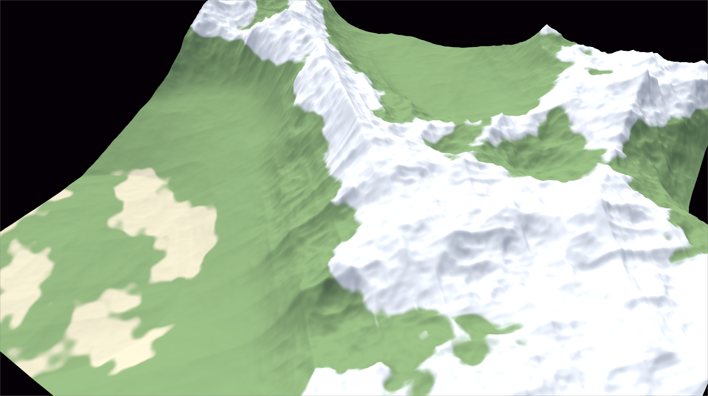
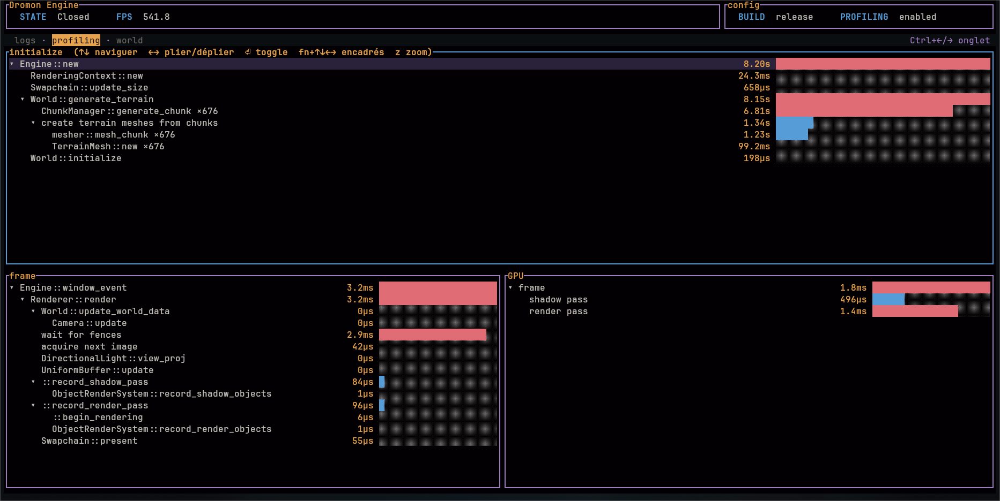

# Dromon

A 3D game engine written in Rust, built on top of Vulkan via the `ash` crate.

Dromon is a long-term personal project aimed at learning low-level graphics programming while building a capable and extensible engine. The goal is to eventually power small games with LLM-driven characters.

## Features

### Engine

- Low-level Vulkan renderer using dynamic rendering.
- Directional lighting with shadow mapping.
- Camera system.
- Input handling (keyboard/mouse).
- Procedural terrain: chunked heightmap generation and meshing.
- Built-in CPU and GPU profiling, streamed to the CLI over a Unix socket.

### CLI

- Companion terminal UI (ratatui) connecting to the engine over a Unix socket.
- Live status: engine state, FPS, build/profiling config.
- Real-time engine logs
- Init call tree, per-frame CPU breakdown, and GPU timestamps.
- Collapsible trees with proportional duration bars.

### Procedural terrain

### Profiling CLI

## Status

Early development, engine foundation in progress.
